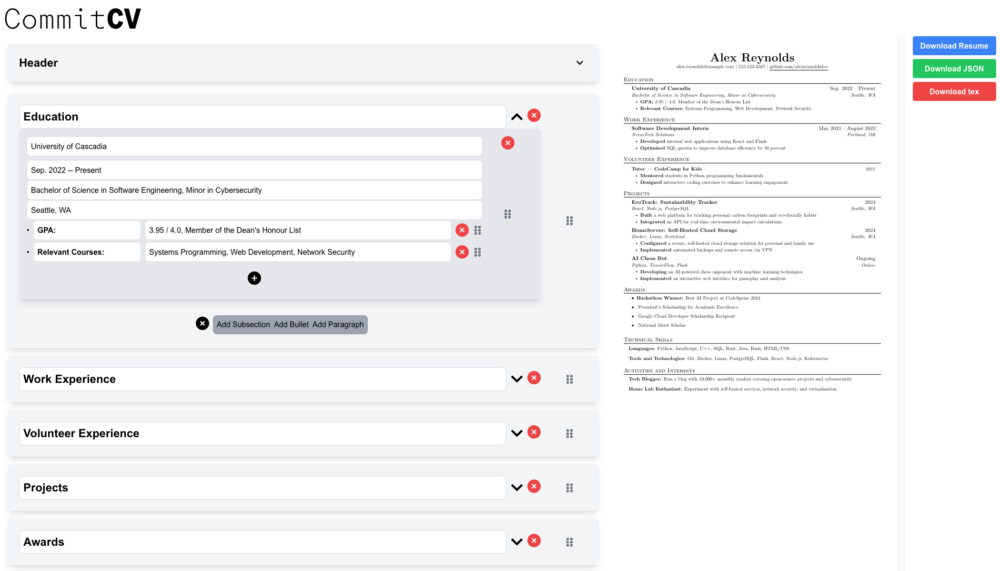

# CommitCV v3 -- PROOF OF CONCEPT

> A majority of the added code for this branch was generated using copilot. These proof of concept features will be migrated into the main releases over time.

### Customize and Modularize your Latex Resume with version control




## Deployment
To deploy CommitCV, clone the repo, create a .env file using the .env.example, and deploy with docker using
```bash
docker compose up -d
```

## Development
When rebuilding the docker containers after initial build the suggestion is that you only rebuild the container that you are developing for (the pdfCV container installs texlive-full and is 7GB)

Build the commitcv-server container with
```bash
docker compose build commitcv-server
```

Build the pdfcv container with
```bash
docker compose build pdfcv
```
