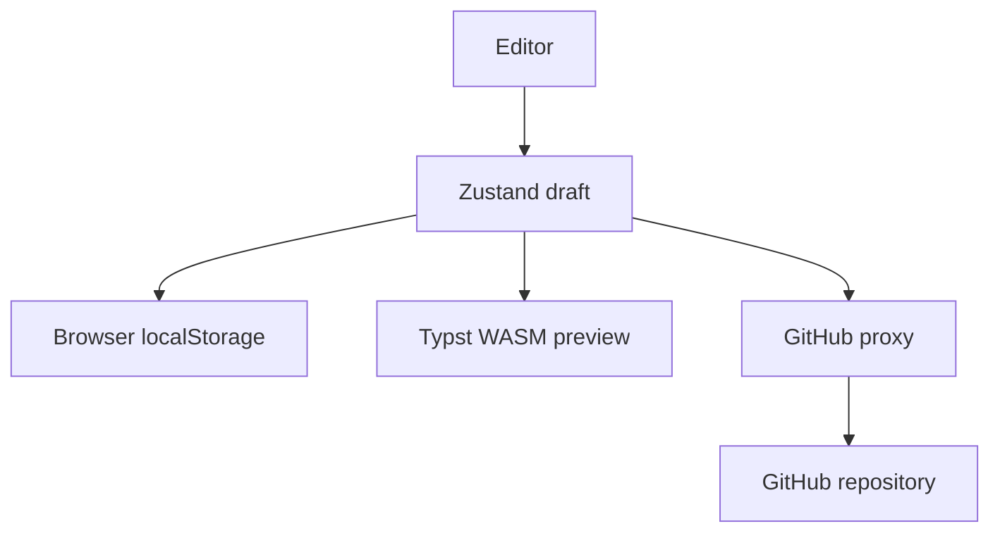

# CommitCV

CommitCV is a local-first resume editor. Resume data stays in the browser
unless you explicitly save it to a GitHub repository.



## Start locally

```bash
pnpm install
pnpm dev
```

The production server serves the Vite build and exposes the GitHub OAuth and
API proxy routes. Copy `.env.example` to `.env` before enabling GitHub sign-in.

## Next

- [Editor workflow](editor.md)
- [Resume schema](schema.md)
- [Typst preview](typst-wasm.md)
