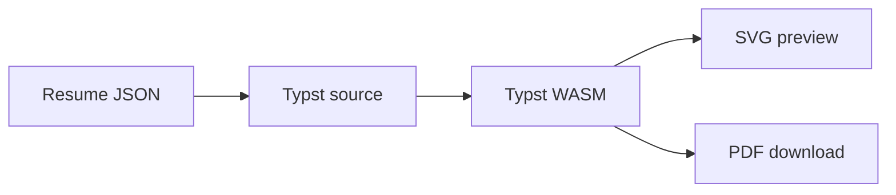

# Typst preview

The browser compiles resume content with Typst WASM. The template, Font
Awesome package, and fonts are served from the application, so resume text is
not sent to a third-party renderer.

Compiling runs in a Web Worker, so typing and PDF export never block the
page. One worker holds the compiler for both the preview and PDF export. When
renders queue up during fast typing, only the newest one runs. If the worker
crashes, pending renders fail and the next render starts a new worker.

The emitter escapes user text before adding formatting markup. Standalone Typst
exports inline the template and icon package so the file can be opened outside
CommitCV.
